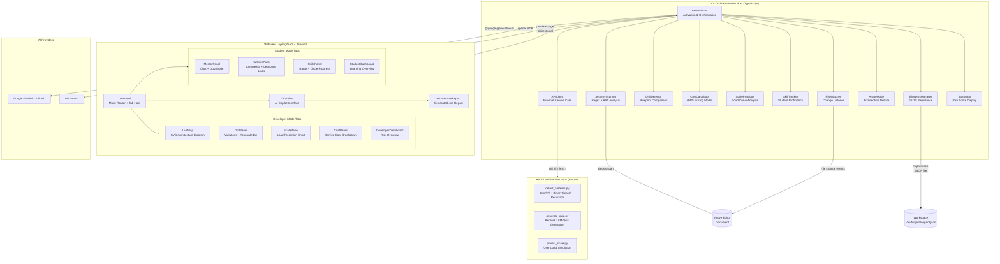

# 🚀 DevForge

> **Architecture-First IDE Extension** — Real-time security scanning, drift detection, pattern analysis, cost estimation, and AI-powered mentorship, built directly into VS Code.


---

## 📐 System Architecture



---

## ✨ Features

### 👨‍💻 Developer Mode
| Feature | Description |
|---------|-------------|
| **Live Map** | Real-time SVG architecture diagram auto-detected from code — nodes colour-coded by type (input/process/storage/external/security) |
| **Drift Detection** | Compares running code against a stored blueprint; violations shown with severity badges, one-click **Acknowledge** to dismiss |
| **Scale Predictor** | Recharts line graph showing user-load vs latency, predicting failure points before they happen |
| **Cost Analysis** | Itemised AWS service breakdown with a circular budget-usage indicator and savings suggestions |
| **Security Gate** | Blocks shipping when critical violations are present; supports **Auto-Fix** (writes safe env-var replacements) and **Acknowledge & Dismiss** |
| **Generate Report** | Produces a full `.md` architecture report (12 findings, 4 metric scores, cost table, remediation plan) — opens in VS Code beside view |
| **Architecture Copilot** | AI chat powered by Gemini 2.0 Flash or Grok-2, contextual to your open codebase |

### 🎓 Student Mode
| Feature | Description |
|---------|-------------|
| **Mentor Panel (Chat)** | Architecture Advisor chat with domain-specific quick chips |
| **Mentor Panel (Quiz)** | 4-question algorithm quiz with A/B/C/D selection, answer reveal, explanation, and circular score ring |
| **Pattern Mapper** | Detects O(n²/n³) loops, binary search, sorting, recursion — shows **file + line number** and **clickable LeetCode links** opening in browser |
| **Skills Radar** | Radar chart + circular SVG progress rings per skill (amber/cyan/red coded), updates live from quiz results |
| **Interview Prep** | Triggers dynamic quiz generation via AWS Bedrock through the quiz modal |

---

## 🏗 Repository Structure

```
devforge/
├── forge/                          # VS Code Extension
│   ├── src/
│   │   ├── extension.ts            # Entry point, command registration, webview provider
│   │   ├── extension/
│   │   │   ├── apiClient.ts        # Fetch wrapper for Lambda endpoints
│   │   │   ├── argueMode.ts        # Architecture debate / justification scorer
│   │   │   ├── blueprintManager.ts # Async JSON blueprint persistence
│   │   │   ├── costCalculator.ts   # AWS Pricing tier logic
│   │   │   ├── driftDetector.ts    # Blueprint vs code comparison engine
│   │   │   ├── fileWatcher.ts      # VS Code file system events
│   │   │   ├── scalePredictor.ts   # Load simulation calculations
│   │   │   ├── securityScanner.ts  # Regex-based vulnerability detection
│   │   │   ├── serviceDetector.ts  # Auto-detect frameworks from imports
│   │   │   ├── skillTracker.ts     # Student skill score management
│   │   │   └── statusBar.ts        # VS Code status bar risk HUD
│   │   ├── webviews/
│   │   │   ├── panels/
│   │   │   │   ├── LeftPanel.tsx   # Mode router + tab orchestrator
│   │   │   │   └── RightPanel.tsx  # Legacy panel
│   │   │   └── components/
│   │   │       ├── chat/
│   │   │       │   ├── ChatView.tsx           # Full AI chat interface
│   │   │       │   ├── ArchitectureReport.tsx # Generated audit report UI
│   │   │       │   ├── ChatInput.tsx          # Persistent input bar
│   │   │       │   └── ModelSelector.tsx      # Gemini / Grok toggle
│   │   │       ├── developer/
│   │   │       │   ├── DeveloperDashboard.tsx
│   │   │       │   ├── DriftPanel.tsx         # Violations + Acknowledge
│   │   │       │   ├── ScalePanel.tsx         # Recharts load graph
│   │   │       │   └── CostPanel.tsx          # Cost breakdown + Generate Report
│   │   │       ├── student/
│   │   │       │   ├── StudentDashboard.tsx
│   │   │       │   ├── MentorPanel.tsx        # Chat + Quiz tab switcher
│   │   │       │   ├── PatternsPanel.tsx      # Complexity + LeetCode links
│   │   │       │   └── SkillsPanel.tsx        # Radar + circular progress rings
│   │   │       ├── LiveMap.tsx                # Local SVG architecture graph
│   │   │       ├── SecurityGateModal.tsx      # Critical violation overlay
│   │   │       ├── BlueprintForm.tsx          # Blueprint constraint editor
│   │   │       └── QuizModal.tsx              # Interview prep quiz modal
│   │   └── shared/
│   │       └── types.ts                       # Shared TypeScript interfaces
│   ├── package.json
│   └── esbuild.js                             # Extension host bundler
├── lambdas/
│   ├── detect_patterns.py       # Pattern detection: loops, sort, binary search, recursion
│   ├── generate_quiz.py         # AWS Bedrock quiz generation
│   └── predict_scale.py         # User-load timeline simulation
├── sample-project/
│   └── index.js                 # Demo codebase with intentional issues for all tabs
├── webpack.config.js            # Webview bundler config
├── package.json                 # Root build orchestration
└── .env                         # API keys (git-ignored)
```

---

## 🚀 Getting Started

### Installation from VSIX (For Judges & Evaluators)

This extension is packaged as a VSIX file for easy installation without the Visual Studio Marketplace.

**Installation Steps:**

1. **Download** the VSIX file from the `release/` folder in this repository:
   - `devforge-extension-0.0.1.vsix`

2. **Open VS Code**

3. **Go to Extensions panel** (Ctrl+Shift+X / Cmd+Shift+X)

4. **Click the three-dot menu** (⋯) at the top of the Extensions panel

5. **Select "Install from VSIX"**

6. **Choose the downloaded `devforge-extension-0.0.1.vsix` file**

7. **Reload VS Code** when prompted

The extension will now be installed and ready to use. Open `sample-project/index.js` to see it in action.

---

### 📋 Prototype Build Information

This is the **prototype build of the DevForge extension** for evaluation purposes. The VSIX package includes:

- Full VS Code extension with TypeScript source
- React-based webview UI with Tailwind CSS
- Real-time security scanning, drift detection, and cost analysis
- AI-powered architecture copilot (Gemini 2.0 Flash / Grok-2)
- Student learning mode with pattern detection and skill tracking
- Pre-built demo project with sample code for testing all features

**Version:** 0.0.1  
**Publisher:** devforge  
**Minimum VS Code:** 1.109.0

---

### Prerequisites (For Development)
- Node.js 18+
- VS Code 1.80+
- Python 3.9+ (for Lambda local testing)
- AWS account (for Lambda deployment, optional)

### 1. Clone & Install

```bash
git clone <your-repo-url>
cd devforge
npm install
cd forge && npm install && cd ..
```

### 2. Configure API Keys

Create a `.env` file in the **project root**:

```env
GEMINI_API_KEY="your-gemini-key-here"
GROK_API_KEY="your-grok-key-here"
```

Or set them in VS Code settings:
```json
{
  "devforge.geminiApiKey": "your-key",
  "devforge.grokApiKey": "your-key",
  "devforge.preferredAiModel": "gemini"
}
```

### 3. Build

```bash
npm run compile
```

This runs Webpack (webviews) + esbuild (extension host) in sequence.

### 4. Launch

Press **F5** in VS Code to open the Extension Development Host.

> 💡 Open `sample-project/index.js` to trigger a full analysis immediately — it contains intentional security issues, drift violations, and algorithmic patterns for demo purposes.

---

## 🧪 Demo Walkthrough

1. **Open** `sample-project/index.js` — DevForge auto-scans on load
2. **Developer → Live Map** — See the inferred architecture SVG
3. **Developer → Drift** — See 5 blueprint violations; click **Acknowledge** to dismiss one
4. **Developer → Scale** — View user-load prediction chart
5. **Developer → Cost** — See per-service breakdown; click **Generate Report**
6. **Report** — Full `.md` report opens in a beside panel; click **Export .md** to save
7. **Chat** — Type anything to invoke Gemini 2.0 Flash
8. **Student → Patterns** — Click a LeetCode link to open in browser
9. **Student → Mentor → Quiz** — Take the 4-question algorithm quiz
10. **Student → Skills** — Watch circular progress rings update

---

## 🔐 Security

- API keys read from `.env` at runtime — never bundled into webview
- `.env` is in `.gitignore`
- SecurityScanner uses specific regex patterns to avoid false positives
- Lambda functions enforce 50 KB payload size limits
- Webview CSP restricts `unsafe-eval` and only allows extension-origin scripts

---

## 🛠 Architecture Decisions

| Decision | Rationale |
|----------|-----------|
| **esbuild for extension host** | Fast incremental TypeScript compilation |
| **Webpack for webviews** | Better CSS/asset handling for React bundles |
| **Local SVG LiveMap** | Avoids CSP issues from external diagramming APIs |
| **Auto model fallback** | If no model configured, auto-selects first available key (Gemini → Grok) |
| **Circular SVG progress rings** | Custom SVG for zero runtime dependency and full colour control |
| **fs.promises throughout** | Non-blocking I/O, critical for extension responsiveness |
| **Debounced runAnalysis** | 300ms debounce + AbortController prevents redundant API calls on fast typing |

---

## 📦 Lambda Functions

| Function | Trigger | Description |
|----------|---------|-------------|
| `detect_patterns.py` | HTTP POST `/detect` | Detects O(n²/n³) loops, binary search, sorting, recursion patterns in source code |
| `generate_quiz.py` | HTTP POST `/quiz` | Uses AWS Bedrock (Claude) to generate contextual algorithm quiz questions |
| `predict_scale.py` | HTTP POST `/scale` | Simulates user-load timeline with health score degradation curves |

### Local Lambda Testing
```bash
cd lambdas
python detect_patterns.py  # Requires mock event JSON
```

---

## 🧩 Extension Commands

| Command | Description |
|---------|-------------|
| `devforge.analyzeCode` | Trigger full analysis of active file |
| `devforge.startInterviewPrep` | Launch interview prep quiz |
| `devforge.generateBlueprint` | Open blueprint constraint form |
| `devforge.autoFixSecurity` | Auto-replace hardcoded secrets with env vars |

---

## 📄 License

MIT — See [LICENSE](LICENSE) for details.

---

<div align="center">
  <strong>Built for developers who ship architecture, not just code.</strong><br/>
  <sub>DevForge · VS Code Extension · 2026</sub>
</div>
