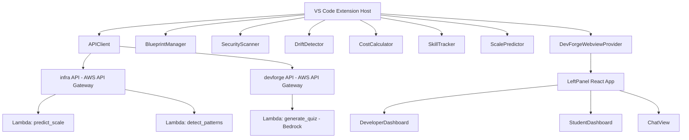

# DevForge Codebase Audit Report

## Executive Summary

DevForge is a VS Code extension with an architecture-first focus, serving two personas (Student and Developer). The codebase consists of a TypeScript VS Code extension host (`forge/src/extension/`), a React webview layer (`forge/src/webviews/`), and three AWS Lambda functions (`lambdas/`). The extension is well-structured conceptually, but the current implementation contains a significant number of correctness issues, security risks, dead code, and scalability anti-patterns that must be resolved before any production use.

---

## System Architecture Overview



---

## 1. Code Quality

### 1.1 Hardcoded API Endpoints in Production Code

**File:** file:forge/src/extension/apiClient.ts (lines 4–5), file:forge/src/webviews/components/ArchitectureDiagram.tsx (line 119)

Two private AWS API Gateway base URLs are hardcoded directly in source:

```
private infraApiBase = 'https://1plv9rmbhb.execute-api.eu-north-1.amazonaws.com/dev';
private devforgeApiBase = 'https://ghwl6o43ch.execute-api.eu-north-1.amazonaws.com/dev';
```

`ArchitectureDiagram.tsx` also hard-codes the same devforge URL in a `getApiUrl()` function. These should be driven by VS Code extension configuration (already declared in `package.json` as `devforge.apiEndpoint`), not literal strings. Any endpoint change requires a full recompile and republish.

---

### 1.2 `@ts-ignore` Suppression & Type Safety Violations

**File:** file:forge/src/extension.ts (line 265), file:forge/src/webviews/panels/RightPanel.tsx (line 14)

`// @ts-ignore` is used above an `ArgueMode` instantiation inside a `switch` case, and `acquireVsCodeApi()` is accessed without a type definition. Both suppress legitimate TypeScript errors instead of resolving them. The `ArgueMode` instance also leaks per-invocation — it is created on every `justifyResult` message, wasting allocation.

---

### 1.3 Unused Functions and Dead Code

**Files:** file:forge/src/extension.ts, forge/src/extension/mockData.ts

- `showQuickTutorial()` (extension.ts, line 489) is defined but **never called** anywhere in the codebase.
- The entire forge/src/extension/mockData.ts module exposes `getMockRiskScores`, `getMockViolations`, `getMockAnalysis`, `getMockBlueprint`, `getMockScaleTimeline`, and `getMockPatterns` — none of which are imported or referenced anywhere in production code paths after mock-removal. This dead module adds confusion about what data is real vs. simulated.
- `FileWatcher.onDidChangeTextDocument` handler (line 16) is a no-op empty body, yet the event listener is still registered, consuming memory on every keystroke.
- The `ArchitectureDiagram` component is imported and commented out in `LeftPanel.tsx` (lines 7, 178–182) — the Live Map tab is unreachable.

---

### 1.4 Poor Naming and Misleading Semantics

**File:** file:forge/src/extension/blueprintManager.ts

`ensureDirectory()` re-reads `vscode.workspace.workspaceFolders?.[0].uri.fsPath` internally despite the class already caching `this.workspaceRoot` in the constructor. This is redundant and inconsistent — if the workspace ever changes, the cached value and the re-read value could diverge.

**File:** file:forge/src/webviews/components/developer/DeveloperDashboard.tsx

`ScoreCard` uses `type = 'consistency'` but maps to a `GitCommit` icon and hardcodes `score={0.8}` — a magic literal baked directly into JSX, bypassing the actual `riskScores` from the extension. The label says "Draft Align" but the value is never dynamic.

---

### 1.5 Chat Response is a Keyword-Matching Fake AI

**File:** file:forge/src/extension.ts (lines 396–413)

`_handleChatMessage()` uses naive `string.includes()` matching against "security", "scale", and "cost" to return hardcoded strings. It does not call any LLM or backend API. The cost figure ("$112/mo") is static and unrelated to the user's blueprint. This is indistinguishable from broken functionality to end users.

---

### 1.6 Interview Prep Uses a Hard-Coded Quiz

**File:** file:forge/src/extension.ts (lines 339–356)

`_handleStartInterviewPrep()` always returns the **same quiz object** about RDS Proxy via a `setTimeout(1500)`, regardless of the user's actual project or blueprint. The `generate_quiz.py` Lambda exists and calls Bedrock to produce real dynamic questions, but is never invoked from here.

---

## 2. Performance

### 2.1 No Debouncing on File-Save Analysis

**File:** file:forge/src/extension.ts (lines 63–151), file:forge/src/extension/fileWatcher.ts

`runAnalysis()` triggers on every `onDidSaveTextDocument` event and fires **6 parallel API calls** (`Promise.all` across `analyzeCode`, `detectDrift`, `scanSecurity`, `calculateRisk`, `estimateCost`, `detectPatterns`), plus a sequential `predictScale` call. There is no debouncing, throttling, or cancellation token. Rapid file saves (e.g., auto-save mode) will hammer the API with cascading concurrent requests, each potentially timing out and triggering the fallback local scan **on top of** the in-flight remote ones.

---

### 2.2 Synchronous Filesystem I/O in Extension Host

**File:** file:forge/src/extension/blueprintManager.ts (lines 38, 54)

`fs.readFileSync` and `fs.writeFileSync` are used in `loadBlueprint()` and `saveBlueprint()`. These are `async` methods by signature, but internally block the Node.js event loop. The extension host's single thread will stall on large blueprint files, freezing VS Code UI responsiveness. They should use `fs.promises.readFile` / `fs.promises.writeFile`.

---

### 2.3 `_sendInitialData()` Makes 2 Redundant API Round-Trips on Every Webview Refresh

**File:** file:forge/src/extension.ts (lines 303–332)

`_sendInitialData()` calls `calculateRisk` and `estimateCost` independently each time the webview resolves. These are the same calls already made inside `runAnalysis()`. If a blueprint has already been loaded and analyzed, the webview initialization causes duplicate round-trips to the API, inflating costs and latency.

---

### 2.4 `predictScale` is a Local Mock Masquerading as an API Call

**File:** file:forge/src/extension/apiClient.ts (lines 83–102)

`APIClient.predictScale()` contains a comment "This would call the /predict-scale endpoint" and then returns a hard-coded mock object without making any HTTP request. The real `predict_scale.py` Lambda is deployed but unreachable. Users see stale, fabricated scale predictions regardless of their actual blueprint configuration.

---

### 2.5 `generateQuiz` Also a Local Mock

**File:** file:forge/src/extension/apiClient.ts (lines 104–118)

Same pattern as `predictScale` — the method returns a static object without calling any endpoint, while the real `generate_quiz.py` Lambda (which calls Amazon Bedrock) exists and is never invoked from the extension.

---

### 2.6 `ArchitectureDiagram` Makes Unguarded Webview-Side Fetch Calls

**File:** file:forge/src/webviews/components/ArchitectureDiagram.tsx (lines 42–49)

The component calls `fetch()` directly from the React webview context. VS Code webviews have strict Content Security Policies; `fetch` to external URLs requires explicit `connect-src` permissions in the CSP header. The current CSP in `_getHtmlForWebview()` only permits `img-src` and `script-src`, which means these fetch calls will fail silently and fall through to `FALLBACK_NODES` on every render.

---

## 3. Maintainability

### 3.1 Test Suite is a Placeholder

**File:** file:forge/src/test/extension.test.ts

The single test file contains only a boilerplate "Sample test" that asserts `[1,2,3].indexOf(5) === -1`. The actual extension logic — `SecurityScanner`, `DriftDetector`, `CostCalculator`, `SkillTracker`, `BlueprintManager`, `ScalePredictor`, `ArgueMode`, `ComprehensionValidator` — has **zero test coverage**. Critical path functions like `runAnalysis`, `_handleAutoFixSecurity`, and `_sendInitialData` are entirely untested.

---

### 3.2 Dual `package.json` with Duplicate Configuration

**Files:** file:package.json, file:forge/package.json

Both files declare identical `contributes` sections (commands, viewsContainers, views, configuration). The root `package.json` points `"main"` to `./forge/dist/extension.js`, making it the actual VS Code manifest. The `forge/package.json` is the inner development package. This structure creates confusion about which file governs the published extension, and any contribution point change must be manually kept in sync across both files.

---

### 3.3 Build System Inconsistency

**Files:** file:package.json, file:forge/package.json, file:forge/esbuild.js

The root `package.json` uses `webpack` for its `compile` script but only bundles the extension entrypoint (`src/extension.ts`) and does not bundle the webviews. The inner `forge/package.json` uses `esbuild` and only lists `src/extension.ts` as an entry point — the React webview bundles (`leftPanel.js`) are not specified in `esbuild.js`. The webview bundles require a separate webpack config (`webpack.config.js` at root), creating a fragile two-tool build pipeline that must be run in correct order to produce a working extension.

---

### 3.4 No JSDoc / TSDoc on Any Extension-Side Module

None of the extension host classes (`apiClient.ts`, `driftDetector.ts`, `securityScanner.ts`, `costCalculator.ts`, `scalePredictor.ts`, `skillTracker.ts`) carry method-level documentation beyond brief inline comments. Return types on several `APIClient` methods rely on `any` (e.g., `predictScale`, `generateQuiz`, `detectPatterns`), making refactoring high-risk.

---

### 3.5 `LeftPanel.tsx` is a God Component (240 lines, 10+ state variables)

**File:** file:forge/src/webviews/panels/LeftPanel.tsx

`LeftPanel` owns all application state (`riskScores`, `violations`, `costEstimate`, `showForm`, `hasBlueprint`, `loading`, `isDemo`, `currQuiz`, `skills`, `scaleFailures`, `patterns`, `mode`, `view`, `activeTab`) and all message routing from the extension host. This violates single-responsibility and makes the component hard to test or extend. State management should be lifted into a context provider or a lightweight state machine.

---

### 3.6 `MentorPanel` Has Hardcoded Mock Conversation History

**File:** file:forge/src/webviews/components/student/MentorPanel.tsx (lines 10–25)

The initial messages array contains a pre-baked Redis explanation exchange that is always displayed to all users, regardless of context. New messages sent through the panel post to the extension host `chatMessage` event, but the response is handled by the keyword-matching fake AI in the extension (see §1.5). The mentor experience is entirely disconnected from any real LLM.

---

## 4. Scalability

### 4.1 No Request Cancellation or Concurrency Guard in `runAnalysis`

**File:** file:forge/src/extension.ts (lines 94–116)

`Promise.all([...6 API calls...])` fires on every save with no mechanism to cancel an in-flight analysis when a new save event arrives. If analysis takes longer than the user's save interval (common in fast typing + auto-save), multiple overlapping analysis cycles run concurrently. The last one to resolve "wins" and updates the UI, which can result in stale data being displayed. An `AbortController` per analysis cycle should cancel the previous one.

---

### 4.2 `DriftDetector` Logic is Fragile and Filename-Dependent

**File:** file:forge/src/extension/driftDetector.ts (lines 17, 56)

Drift detection fires only when `fileName.includes('db') || fileName.includes('repository')`, and the ML pipeline leak check fires only when `fileName.endsWith('.py')`. These string heuristics mean that drift is completely invisible in files that don't match these patterns (e.g., a MongoDB client in `services/data.ts`).

---

### 4.3 `SecurityScanner` Generic API Key Regex is Extremely Noisy

**File:** file:forge/src/extension/securityScanner.ts (line 5)

The `'API Key'` pattern is `/[A-Z0-9]{20,}/g` — any uppercase alphanumeric string of 20+ characters triggers a `critical` security violation. This will generate false positives on UUIDs, base64-encoded values, enum constants, and other legitimate code patterns, producing alert fatigue that will cause users to dismiss real security warnings.

---

### 4.4 `predict_scale.py` Timeline May Have Duplicate User-Count Entries

**File:** file:lambdas/predict_scale.py (lines 30–61)

If `current_users >= db_capacity * 0.5`, the "50% healthy" milestone is skipped, but the initial `current_users` entry is still appended unconditionally. When `current_users` equals `db_capacity * 0.8` exactly, two entries at the same user count exist: one healthy (`status: 'healthy'`) and one degraded (`status: 'degraded'`). After sorting, the ordering is non-deterministic.

---

### 4.5 `detect_patterns.py` Nested Loop Counter is Unreliable

**File:** file:lambdas/detect_patterns.py (lines 93–105)

`count_nested_loops()` treats every line containing `for` or `while` as incrementing depth, and every `}` or `end` as decrementing it. This will miscount in Python (no braces), TypeScript arrow functions with `for...of`, template literals containing `for`, and comment lines. The depth tracking does not account for non-loop uses of `for` (e.g., `for...in` on object keys in Python docstrings, or the word `for` in string literals).

---

### 4.6 `has_binary_search` Operator Precedence Bug

**File:** file:lambdas/detect_patterns.py (line 126)

```python
return 'mid' in code and ('left' in code or 'right' in code) and '/2' in code or '>> 1' in code
```

Due to Python's `and`/`or` precedence, this evaluates as:  
`(... and '/2' in code) or ('>> 1' in code)`. Any code containing `>> 1` anywhere — including comment lines, right-shift operations, or string literals — is classified as binary search, regardless of whether `mid`, `left`, or `right` are present. Missing parentheses here cause silently wrong detections.

---

### 4.7 `SecurityGateModal` Blocks All UI with No Dismiss Option

**File:** file:forge/src/webviews/components/SecurityGateModal.tsx (lines 19–67)

The modal renders with `z-[9999]` and `position: fixed; inset: 0` whenever any `critical` severity violation is present. Given the noisy security scanner (§4.3), users can be permanently blocked from using the UI. There is no "acknowledge and dismiss" option, no way to suppress false positives, and the modal is re-triggered on every analysis cycle. The "Initialize Auto-Remediation" button calls `autoFixSecurity` which only replaces AKIA key patterns — it will not resolve scanner false positives, leaving the modal permanently visible.

---

### 4.8 Mode Selection is Described as "Permanent" but is Overridable in UI

**File:** file:forge/src/extension.ts (line 477), file:forge/src/webviews/panels/LeftPanel.tsx (lines 143–155)

The onboarding modal tells users their mode choice is "permanent," but `LeftPanel.tsx` renders a live mode toggle switch that can change `mode` between `student` and `developer` at any time without updating `globalState`. The extension host and the webview can fall out of sync: `runAnalysis` reads `globalState` for mode filtering, while the UI renders based on local React state.

---

## 5. Best Practices

### 5.1 CSP Uses `unsafe-eval` in Production Webview

**File:** file:forge/src/extension.ts (line 443)

```
script-src 'unsafe-eval' ${webview.cspSource}
```

`unsafe-eval` is explicitly recommended against in VS Code webview security guidelines. It allows eval-based code execution inside the webview, opening a significant XSS attack surface if any user-controlled content is ever rendered. This should be replaced with a nonce-based approach or removed entirely.

---

### 5.2 `acquireVsCodeApi()` Called at Module Level in `RightPanel.tsx`

**File:** file:forge/src/webviews/panels/RightPanel.tsx (line 14)

```ts
// @ts-ignore
const vscode = acquireVsCodeApi();
```

This differs from the pattern in `LeftPanel.tsx` which imports from `vscodeApi.ts` (which guards the call with `typeof acquireVsCodeApi !== 'undefined'`). The direct call in `RightPanel.tsx` will throw a `ReferenceError` if the bundle is ever loaded outside a webview context (e.g., unit tests, Storybook). It bypasses the safe wrapper already built into the project.

---

### 5.3 `generate_quiz.py` Instantiates Bedrock Client at Module Level

**File:** file:lambdas/generate_quiz.py (line 5)

```python
bedrock = boto3.client('bedrock-runtime')
```

This is executed at import time (cold start), not inside the handler. While this is a common Lambda optimization, it means any IAM permission issue, region misconfiguration, or Bedrock endpoint unavailability causes **every invocation** to fail at import time with no recoverable error message. The client should be instantiated inside the handler with appropriate try/except, or at module level but with lazy initialization.

---

### 5.4 `BlueprintForm` Allows `currentUsers: 0` as a Valid Default

**File:** file:forge/src/webviews/components/BlueprintForm.tsx (line 13)

`currentUsers` defaults to `0`. The scale predictor and API use this value in division and threshold calculations. A value of `0` produces undefined behavior in `predict_scale.py` when `current_users < db_capacity * 0.5` is tested, and in `CostCalculator.compareToBudget` when `budget > 0` guards against division by zero but `currentUsers` does not. No form-level validation prevents submission of zero-user constraints.

---

### 5.5 React Key Using Array Index in All List Renders

**Files:** file:forge/src/webviews/components/SecurityGateModal.tsx, file:forge/src/webviews/components/developer/DriftPanel.tsx, file:forge/src/webviews/components/chat/ArchitectureReport.tsx

`key={i}` (array index) is used across violation lists, cost breakdowns, and report sections. When violations are re-ordered or filtered, React's diffing algorithm will incorrectly match DOM nodes, causing visual glitches, stale state in child components, and failed animations on list updates.

---

### 5.6 `isDemo` State Is Declared but Never Used

**File:** file:forge/src/webviews/panels/LeftPanel.tsx (line 52)

`const [isDemo, setIsDemo] = useState(false)` is declared and updated via the message handler, but `isDemo` is never read or passed to any child component. The state update logic is wired but the rendering path is disconnected.

---

### 5.7 Python Lambda Has No Input Length Validation

**Files:** file:lambdas/generate_quiz.py, file:lambdas/detect_patterns.py

`generate_quiz.py` truncates code at 500 characters in the prompt string but does not reject or cap the raw `code` payload in the request body. A malicious actor could send arbitrarily large payloads, causing Lambda memory exhaustion or extremely high Bedrock token costs. `detect_patterns.py` passes the full `code` string to all detection functions without any length check.

---

## Summary Severity Matrix


| #   | Finding                                                           | Severity    | Category        |
| --- | ----------------------------------------------------------------- | ----------- | --------------- |
| 1.1 | Hardcoded API endpoints                                           | 🔴 High     | Code Quality    |
| 1.2 | `@ts-ignore` + ArgueMode leak                                     | 🟡 Medium   | Code Quality    |
| 1.3 | Dead code (mockData, showQuickTutorial, FileWatcher no-op)        | 🟡 Medium   | Maintainability |
| 1.4 | `ensureDirectory` redundancy + magic literal score                | 🟡 Medium   | Code Quality    |
| 1.5 | Chat AI is keyword-matching fake                                  | 🔴 High     | Code Quality    |
| 1.6 | Interview prep uses static hardcoded quiz                         | 🔴 High     | Code Quality    |
| 2.1 | No debounce on analysis triggering 6 API calls                    | 🔴 High     | Performance     |
| 2.2 | Synchronous filesystem I/O on extension host thread               | 🔴 High     | Performance     |
| 2.3 | Duplicate API calls in `_sendInitialData`                         | 🟡 Medium   | Performance     |
| 2.4 | `predictScale` is a local mock, Lambda never called               | 🔴 High     | Performance     |
| 2.5 | `generateQuiz` is a local mock, Lambda never called               | 🔴 High     | Performance     |
| 2.6 | `ArchitectureDiagram` fetch fails due to CSP                      | 🔴 High     | Performance     |
| 3.1 | Zero real test coverage                                           | 🔴 High     | Maintainability |
| 3.2 | Duplicate `package.json` manifests                                | 🟡 Medium   | Maintainability |
| 3.3 | Inconsistent dual build system (webpack + esbuild)                | 🟡 Medium   | Maintainability |
| 3.4 | No TSDoc on public APIs, heavy use of `any`                       | 🟡 Medium   | Maintainability |
| 3.5 | `LeftPanel` God Component                                         | 🟡 Medium   | Maintainability |
| 3.6 | Hardcoded mock conversation in `MentorPanel`                      | 🟡 Medium   | Maintainability |
| 4.1 | No `AbortController` / request cancellation                       | 🔴 High     | Scalability     |
| 4.2 | Drift detection relies on filename heuristics                     | 🟡 Medium   | Scalability     |
| 4.3 | Security scanner `[A-Z0-9]{20,}` produces massive false positives | 🔴 High     | Scalability     |
| 4.4 | `predict_scale.py` duplicate timeline entries                     | 🟡 Medium   | Scalability     |
| 4.5 | `detect_patterns.py` loop counter broken for Python/TS            | 🟡 Medium   | Scalability     |
| 4.6 | `has_binary_search` operator precedence bug                       | 🔴 High     | Best Practices  |
| 4.7 | `SecurityGateModal` undismissable with false positive scanner     | 🔴 Critical | Scalability     |
| 4.8 | Mode toggle desyncs globalState from UI state                     | 🟡 Medium   | Scalability     |
| 5.1 | `unsafe-eval` in webview CSP                                      | 🔴 High     | Best Practices  |
| 5.2 | `acquireVsCodeApi()` without guard in `RightPanel`                | 🟡 Medium   | Best Practices  |
| 5.3 | Bedrock client at Lambda module level (no error isolation)        | 🟡 Medium   | Best Practices  |
| 5.4 | `currentUsers: 0` default bypasses scale calculations             | 🟡 Medium   | Best Practices  |
| 5.5 | `key={i}` index keys on all violation/cost lists                  | 🟡 Medium   | Best Practices  |
| 5.6 | `isDemo` state declared but never consumed                        | 🟢 Low      | Code Quality    |
| 5.7 | No payload size validation in Python Lambdas                      | 🔴 High     | Best Practices  |


---

## Recommended Priority Order for Remediation

1. **Critical/Blocking:** Fix `SecurityGateModal` dismiss behavior + security scanner false-positive regex (§4.7 + §4.3) — currently makes the extension unusable.
2. **API Correctness:** Wire real Lambda calls for `predictScale` and `generateQuiz` in `APIClient` (§2.4 + §2.5), and connect `generate_quiz.py` to interview prep (§1.6).
3. **Performance / Reliability:** Add `AbortController` debouncing to `runAnalysis` (§4.1), replace sync FS calls (§2.2), and fix CSP for webview fetch (§2.6).
4. **Security:** Remove `unsafe-eval` from CSP (§5.1), move API URLs to configuration (§1.1), add Lambda payload size guards (§5.7).
5. **Code Cleanup:** Delete dead `mockData.ts` and `showQuickTutorial` (§1.3), implement real chat routing (§1.5), deduplicate `package.json` manifests (§3.2).
6. **Testing:** Write unit tests for all extension-side analyzers and integration tests for the webview message protocol (§3.1).
7. **Python Fixes:** Fix `has_binary_search` operator precedence (§4.6), improve `count_nested_loops` accuracy (§4.5), and deduplicate `predict_scale.py` timeline entries (§4.4).

&nbsp;